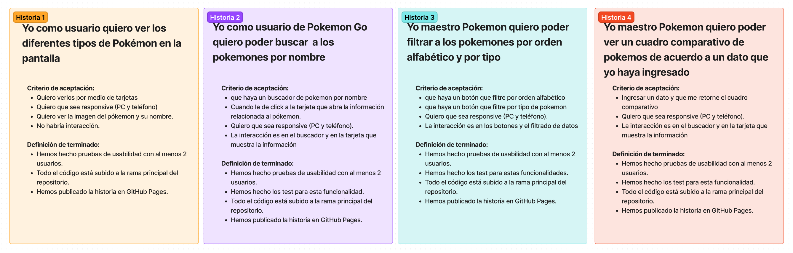
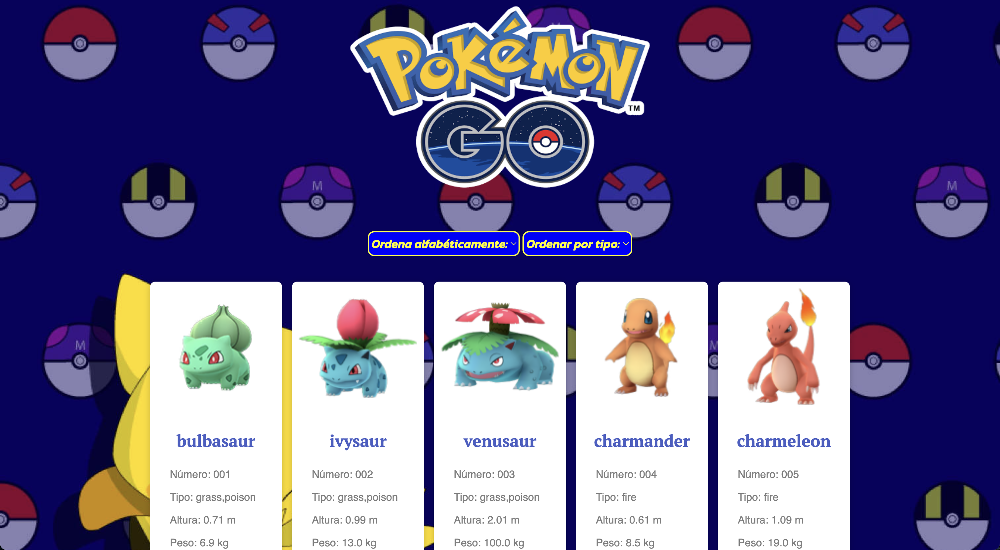
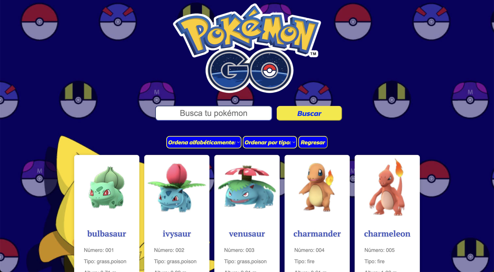
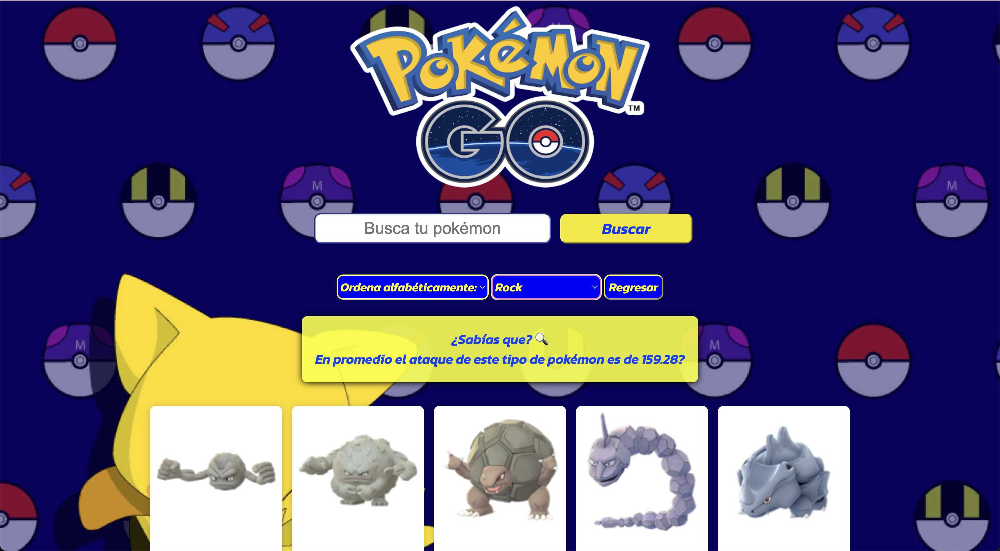

# Data Lovers - Laboratoria - Aline Hurtado

Nuestra página es una fanpage de Pokémon Go que te ayudará a encontrar, filtrar y saber la información más importante de cada uno de los pokémones. 
A través de tarjetas podrás visualizar los pokemones 
*En orden alfabético (A-Z) y (Z-A)
*¡De acuerdo al tipo de pokémon! (Fire, Ice, Rock, entre muchos más...)
*Buscar el pokémon con un buscador que te dará todos los resultados coincidentes
*Además de datos extra que te ayudarán a mejorar tu juego y estrategia como maestro Pokémon

## Historias de Usuario

Primer versión de historias de usuario. Los objetivos, criterios de aceptación y definiciones de terminado aún no estaban hechas. 

En esta segunda versión de las historias de usuario, los objetivos, criterios de aceptación y definiciones de terminado ya están definidas.

***

## Prototipo de Baja fidelidad

## Prototipo de Alta fidelidad

## Historia de Usuario 1 - terminada en código

Para la historia de usuario 1, se muestra en la pantalla las tarjetas de 50 pokemones, donde podemos ver la imagen, el nombre y algunos de los datos particulares como número, tipo y resistencia. 
Utilizamos una función en JavaScript para cortar los datos a 50 pokemones, así como para iterar en cada uno de ellos y que las tarjetas se muestren automaticamente sin tener que hacer una por una. 

Diseñamos y le dimos forma a nuestro proyecto visualmente. Haciendo que las tarjetas tuvieran un diseño responsive, un efecto hover, y que el título de cada pokemon se muestre en un color, fuente y tamaño distinto.

## Historia de Usuario 2 - terminada en código

Para la historia de usuario 2, se añaden en la pantalla los botones de ordenamiento para orden alfabético (A-Z) y (Z-A), así como el ordenamiento por tipo de pokemon. 

Se utilizaron tres funciones: 
1) sortPokemon que ordena los datos por orden alfabético (A-Z) retornando un array con los pokemones en ese orden.
2) sortReverse que ordena los datos por orden alfabético (A-Z) retornando un array con los pokemones en ese orden.
3) filterType que, de acuerdo a tipo de filtro que selecciones, filtra los pokemones retornando un array de pokemones sólo de ese tipo. 

## Historia de Usuario 3 - terminada en código

Para la historia de usuario 3, se añaden en la pantalla el buscador de pokemones, donde puedes introducir el nombre y se mostrarán los resultados de tu búsqueda. 

Se utiliza la función filteredData para hacer match de lo introducido en el input y un filtrado de datos de los pokemones. Retorna un array con los pokemones que coinciden con la búsqueda.

## Historia de Usuario 4 - terminada en código

Para la historia de usuario 4, se añaden en la pantalla una operación, específicamente, cuando seleccionas un **tipo** de pokémon, aparece una leyenda que te informa el **promedio** del **ataque base** de esos pokemones. Así puedes saber qué tipo de pokemon te conviene usar dependiendo del grado de ataque.

Se utiliza la función averageData para calcular el promedio. 

Para esta última funcionalidad un problema que resultó en los test de funcionalidad fue que el resultado esperado estaba en entero, mientras que la función retorna con dos decimales, lo cual hace que el test no pase. 
